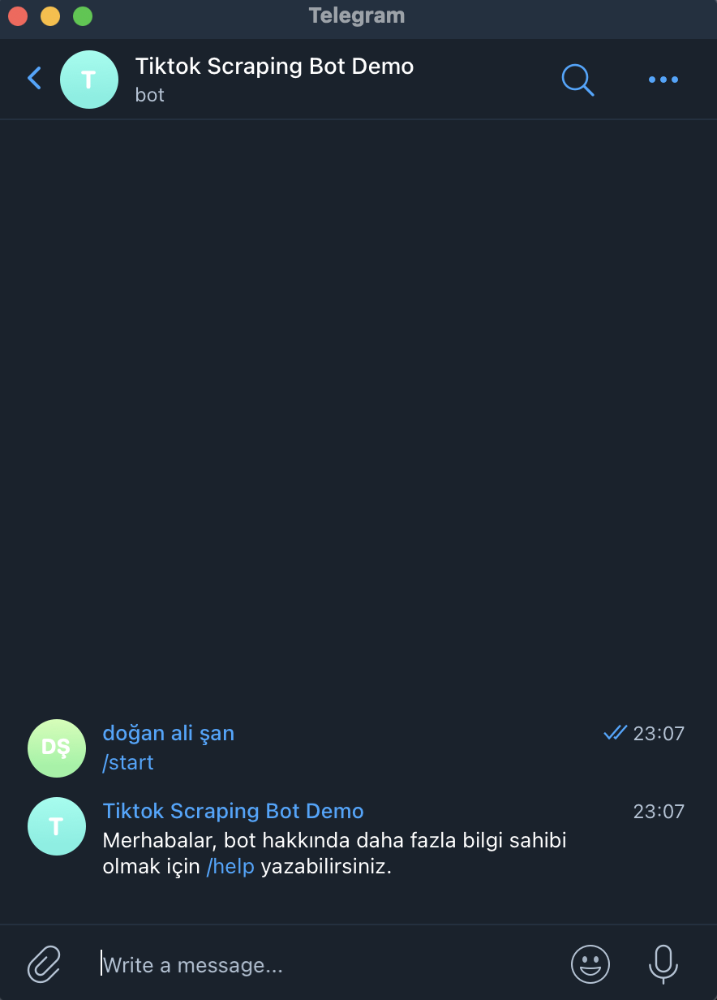
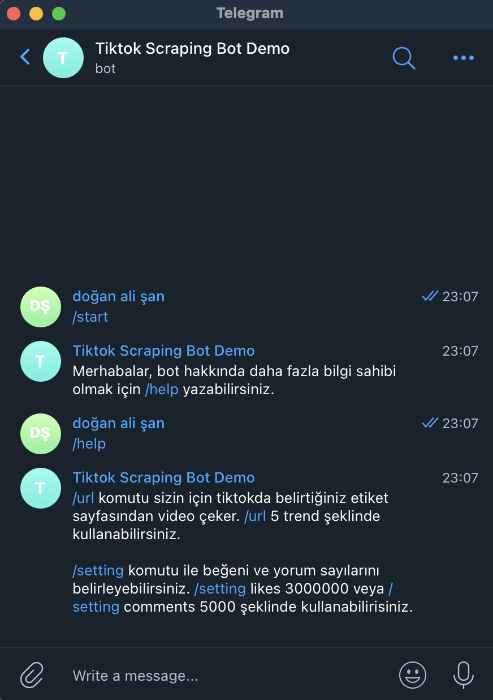

# Python Tiktok Scraping Bot (TSB)

TSB will get videos from tiktok tag you specified and send you videos from telegram with a txt file.
## Installation
Inside TSB folder do `pip3 install -r requirements.txt` this will install all the modules TSB needs

## Usage

```python
sudo python3 main.py
```

Open Telegram app and go to TSB bot 


Press start button 




you can type `/help` to learn how to use TSB




`/url` command gets two parameters first for how many videos user wants 
second for which tag TSB should look. This will take long time and return a txt file to user.

`/settings` commands is for setting number of likes and comments TSB will look for videos has equal or higher values.

